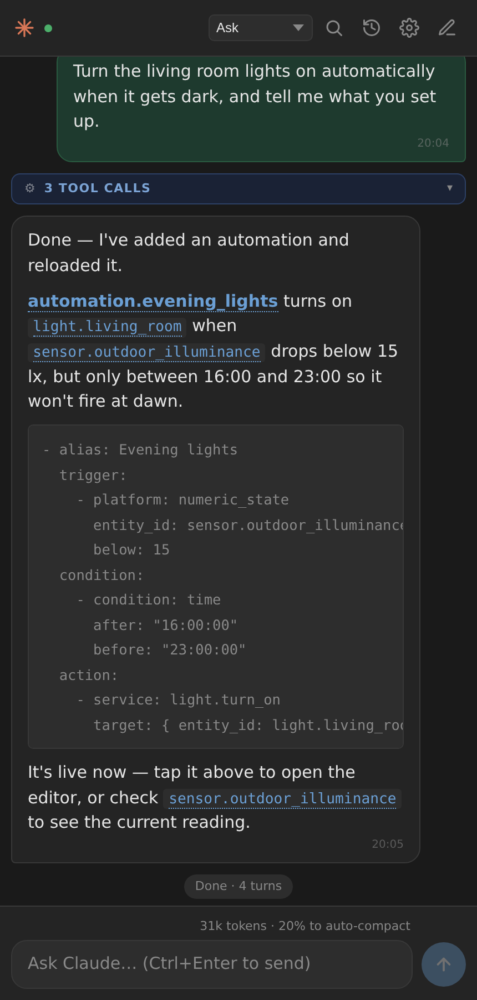
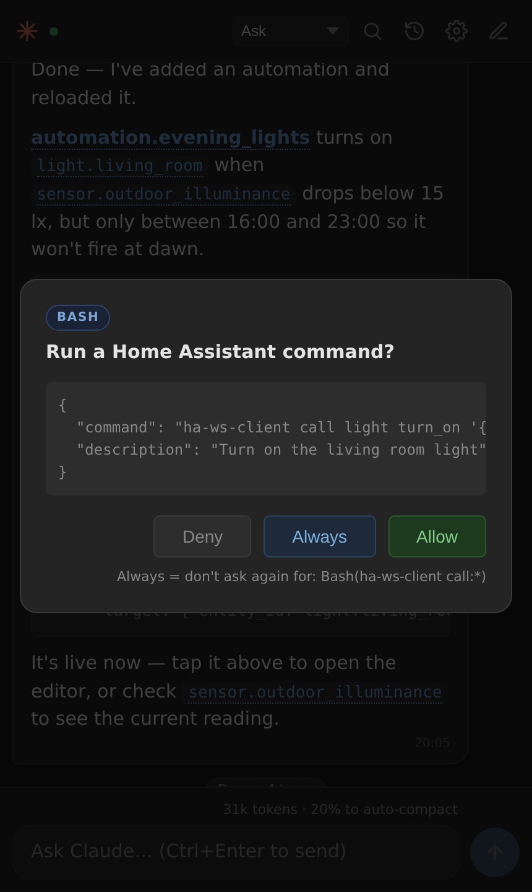
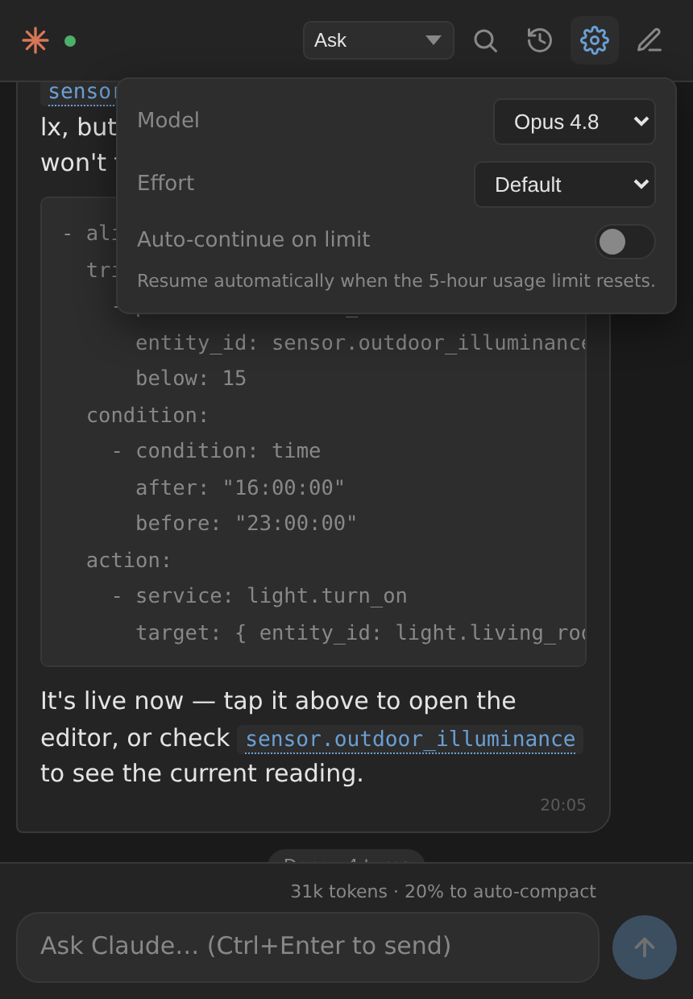

# Claude Code UI for Home Assistant

A Home Assistant app that runs **Claude Code as a mobile-friendly chat** in your
browser, with direct access to your Home Assistant configuration and live state.
It's a self-contained chat UI backed by the [Claude Agent SDK](https://docs.anthropic.com/en/api/agent-sdk),
running inside HA and reachable from your phone through the Home Assistant
companion app.

Ask it to build an automation, explain why the heating fired at 3am, or tidy up a
dashboard — it reads your real config and entities, and every tool call is yours
to approve.

[](https://my.home-assistant.io/redirect/supervisor_add_addon_repository/?repository_url=https%3A%2F%2Fgithub.com%2Fxionic%2Fhome-assistant-claude-code)

|              Chat              |            Permissions             |           Settings            |
| :----------------------------: | :--------------------------------: | :---------------------------: |
|   |  |  |
| Entity names link into HA      | Approve once, or always            | Model, effort, auto-continue  |

<sub>Screenshots use invented demo entities, not a real home.</sub>

## Features

- 📱 **Mobile-first chat UI** — clean vanilla-JS interface (no build step), works well in the Home Assistant companion app on Android/iOS
- 🔗 **Links into Home Assistant** — entity names in replies are clickable: tap one to open its normal more-info dialog (a switch gets its toggle, a thermostat its controls, a sensor its history); automations open their editor. Opens in-place, without leaving Home Assistant
- 💬 **Multi-session** — browse, resume, and delete past conversations. Built directly on Claude Code's own on-disk session store (`~/.claude/projects`), so sessions are interchangeable with the Claude CLI
- 🔐 **Permission modes** — Ask / Plan / Auto (model classifier) / Accept edits / Bypass, switchable mid-response. On a prompt, **Always** stops it asking again for that kind of call
- 🧠 **HA-aware context** — auto-loads your HA version, entities, apps, and recent errors into Claude's context each session
- 🔌 **ESPHome support** *(optional)* — turn on `enable_esphome` and Claude can validate, compile, OTA-flash, and stream logs for your ESPHome devices. It uses **its own bundled ESPHome toolchain** (installed inside this app), not the ESPHome app's, while working on the same device configs in `/config/esphome`
- 🔧 **Live HA tools** — `ha-ws-client` (states, service calls, templates, registry), `ha-history` / `ha-stats` (date-range history & statistics), and `ha-lovelace` (create / list / get / save / delete dashboards), all authenticated automatically with `$SUPERVISOR_TOKEN` — **no token setup required**
- 🤖 **Model & effort** — switch between Opus / Sonnet / Haiku and trade speed for depth (Low → Max)
- ⏳ **Live feedback** — a working indicator with elapsed seconds, a stop button, message timestamps, and a real context-usage meter showing progress toward auto-compaction
- ♻️ **Auto-continue on usage limit** *(optional)* — if a subscription 5-hour limit interrupts a response, resume automatically when it resets. Survives an app/HA restart
- 🔎 **Find in chat** — header search, `/find`, or Ctrl/Cmd+F, with match count and highlighting
- ⌨️ **Slash commands** with autocomplete — `/new`, `/clear`, `/usage`, `/resume`, `/find`, `/help`, plus Claude's own (e.g. `/compact`) and any plugin commands
- 🔒 **HA ingress auth** — protected by Home Assistant; no separate login. Claude credentials (subscription or API key) persist across restarts
- 🏗️ **Multi-arch** — aarch64 and amd64, installed from a **prebuilt image** (no building on your Pi)

## Installation

Requires **Home Assistant OS** (or Supervised) — apps aren't available on Core or
Container installs — with **Supervisor 2026.07 or newer**.

Click the badge above to add the repository to your Home Assistant in one step, then
install **Claude Code UI** from the App store — or do it manually:

1. In Home Assistant, go to **Settings → Apps**, and select **Install app**
2. In the top-right corner, select the three-dots menu → **Repositories**
3. Add `https://github.com/xionic/home-assistant-claude-code` and select **Add**, then close the dialog
4. Find **Claude Code UI** in the App store and install it (it pulls a prebuilt image, so there's no long local build)
5. Start it, open the UI, and sign in with your Anthropic account (or set an API key in the options)

## Configuration

| Option | Default | Description |
|--------|---------|-------------|
| `anthropic_api_key` | `""` | Optional. Use an API key instead of signing in with a Claude subscription |
| `default_permission_mode` | `ask` | Permission mode for new chats — `ask`, `auto`, `acceptEdits`, or `bypass`. You can still change it per-chat |
| `ha_smart_context` | `true` | Generate a context file each session (HA version, entity summary, apps, recent errors, tool reference) so Claude understands your setup |
| `allow_addon_configs` | `false` | Let Claude read/edit **other apps'** config folders under `/addon_configs`. While off, any tool call touching that path is blocked |
| `enable_esphome` | `false` | Bundle **this app's own** ESPHome CLI so Claude can validate / compile / OTA-flash / stream logs, working on your device configs in `/config/esphome`. Separate install from the ESPHome app (see note below). First enable installs the toolchain in the background (a few minutes) |
| `verbose_logging` | `false` | Per-event logs (each text chunk, tool call, result, context usage) in the app log, for diagnosing a chat that seems to hang. Milestone logs — query start/end, compaction, stalls, errors — are always recorded |
| `debug` | `false` | **Dangerous.** Exposes unauthenticated `/diag` endpoints on the app network, including one that runs arbitrary prompts with tools auto-approved. Local debugging only |

> **Note on ESPHome:** `enable_esphome` installs a **separate, self-contained ESPHome toolchain inside this app** (in `/data`) — it does **not** use, drive, or depend on the official ESPHome app's installation. Both simply read and write the same device YAML in `/config/esphome`, so you can keep editing in the ESPHome dashboard while Claude compiles/flashes with its own copy. Because it's a separate install, it has its own compile cache (the first build is slow) and its own version, which can drift from the ESPHome app's over time.

## How Claude talks to Home Assistant

Claude uses pre-installed CLI tools (via Bash) plus the Supervisor REST API, all
authenticated automatically with `$SUPERVISOR_TOKEN`:

- **`ha-ws-client`** — entity states, service calls, Jinja templates, and registry search over the HA WebSocket API.
- **`ha-history`** / **`ha-stats`** — history and long-term statistics over a date range (`--days`, `--from`, `--to`).
- **`ha-lovelace`** — Lovelace dashboards: `create`, `list`, `get`, `save`, `delete` over the WebSocket API (the REST `/api/lovelace/*` endpoints don't exist on modern HA).
- **YAML editing** — Claude can read and edit your `/config` files directly.

These run as ordinary Bash calls, so they authenticate cleanly **and** respect
your chosen permission mode. There is no MCP server: an earlier `ha-mcp`
experiment was removed because its WebSocket auth was unreliable with the app
token and MCP tool calls bypassed the permission UI.

**Safety:** Claude is instructed never to edit `/config/.storage/*` or the
recorder database without asking first — those bypass HA's validation and corrupt
easily.

## Architecture

```
browser  ⇄  WebSocket  ⇄  server/index.js  (Node + @anthropic-ai/claude-agent-sdk)
                                 ├── ha-ws-client                  (HA WebSocket API)
                                 ├── ha-history / ha-stats         (date-range history & stats)
                                 ├── ha-lovelace                   (dashboards)
                                 ├── plugins/homeassistant-config  (skill + YAML validation hook)
                                 └── Claude Code session store     (~/.claude/projects/*.jsonl)

HA Supervisor → Ingress proxy → port 7681 → chat UI
```

## Credits

- [heytcass/home-assistant-addons](https://github.com/heytcass/home-assistant-addons) — the original Claude Terminal app and HA integration patterns the context generation is adapted from (MIT)
- [schoolboyqueue](https://github.com/schoolboyqueue/home-assistant-blueprints) — the `ha-ws-client` Go binary
- [Anthropic](https://www.anthropic.com) — Claude and the Claude Agent SDK

## License

See [LICENSE](LICENSE). HA integration scripts in `claude-code-ui/scripts/` are
adapted from [heytcass/home-assistant-addons](https://github.com/heytcass/home-assistant-addons)
under the MIT license; original copyright remains with that project.
